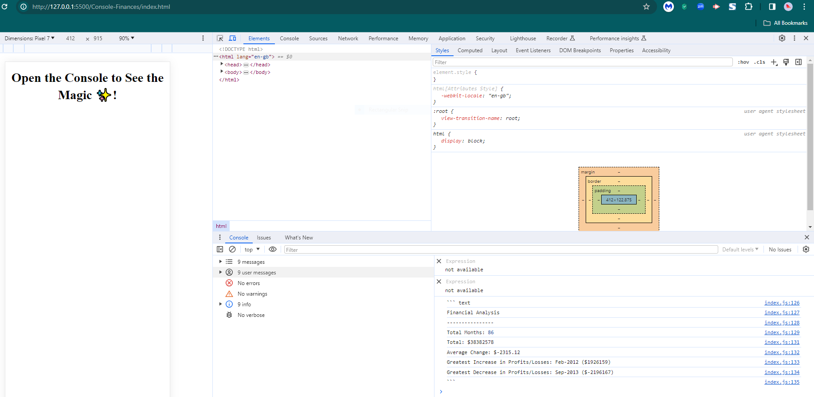

# Console-Finances
Financial Records Analysis Code

Overview
This project involves creating a JavaScript code to analyze financial records of a company. The dataset is composed of arrays with fields including date, profit/loss. The code calculates total number of months, net total profit/loss, average changes in profit/loss, total change in profit/loss from month to month, and the greatest increase/decrease in profit/loss with corresponding dates.

Project Details
Code Structure
The code is structured to analyze the financial dataset. Task include:

Total Number of Months:
The code calculates and displays the total number of months included in the dataset.
Net Total Profit/Loss:

It computes the net total amount of profit/losses over the entire period.
Average Changes in Profit/Loss:
Calculates the average of the changes in profit/losses over the entire period.
Monthly Changes and Average:

The code tracks the total change in profit/loss from month to month and calculates the average.
Greatest Increase/Decrease:
Identifies and displays the greatest increase and decrease in profit/losses, along with the corresponding dates.

Technologies Used
JavaScript

Learning Experience
This project was a significant challenge for me, as I am still in the process of learning JavaScript. Analyzing financial records was an additional difficulty that required understanding the manipulation of arrays, financial calculations. Despite the difficulties, this project gave me practical experience.

Output
The final code prints the financial analysis to the console, utilizing concatenation to combine strings and variables. The average change value is displayed rounded to the nearest 100th.

Repository Contents:
README file
Code File (index.js)
Screenshot
Link to deployed application

A screenshot of the console output displaying the financial analysis results:  
Deployment Link:https://ruslena.github.io/Console-Finances/
Application GitHub URL:git@github.com:RusLena/Bootstrap-Portfolio.git

The JavaScript code file [financial_analysis.js](index.js) containing the analysis logic:

``` text
Financial Analysis
----------------
Total Months: 86
Total: $38382578
Average Change: $-2315.12
Greatest Increase in Profits/Losses: Feb-2012 ($1926159)
Greatest Decrease in Profits/Losses: Sep-2013 ($-2196167)
```

Conclusion
This project was really challenging for a beginner, as I am just starting to learn the basics of JavaScript. The project turned out to be difficult not only for my programming skills, but also because for the first time I had to analyze the financial records of the company, which together was a very complicated task. So I had to do a lot of research to finish the project.

 Best regards, 

 Elena
